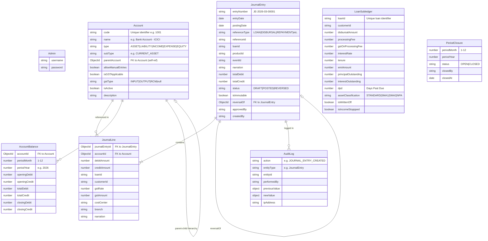
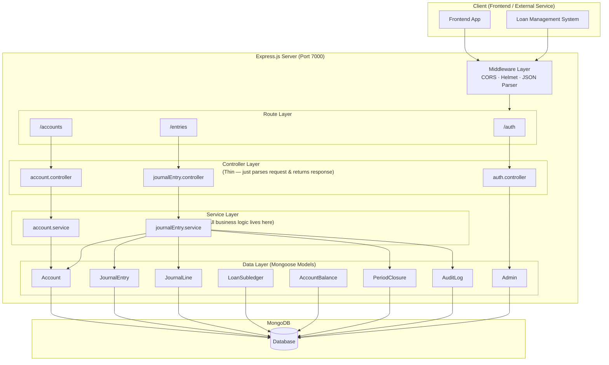
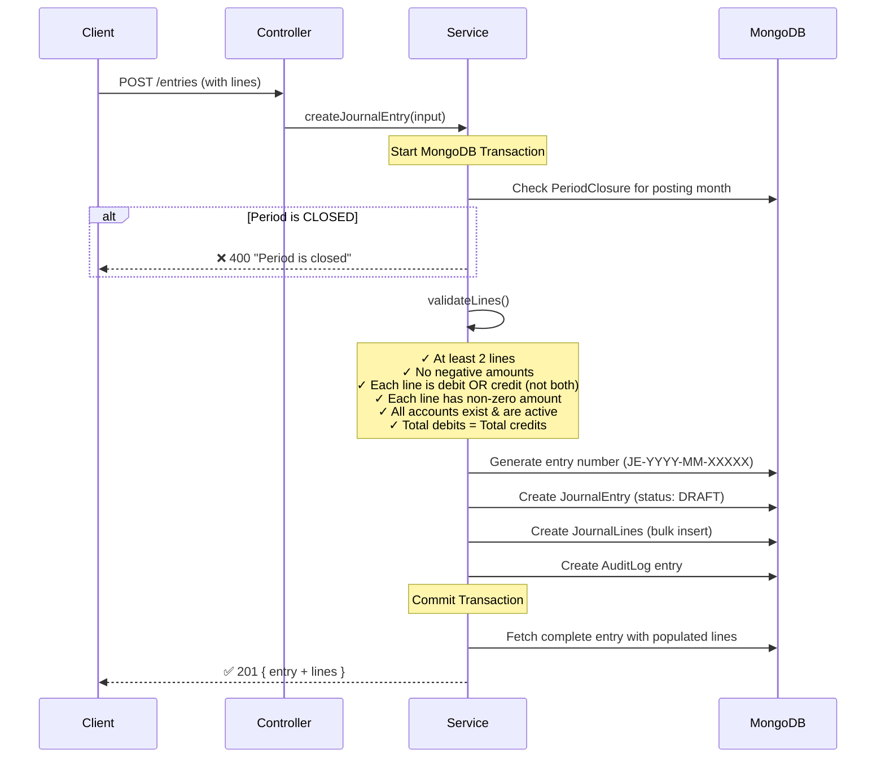
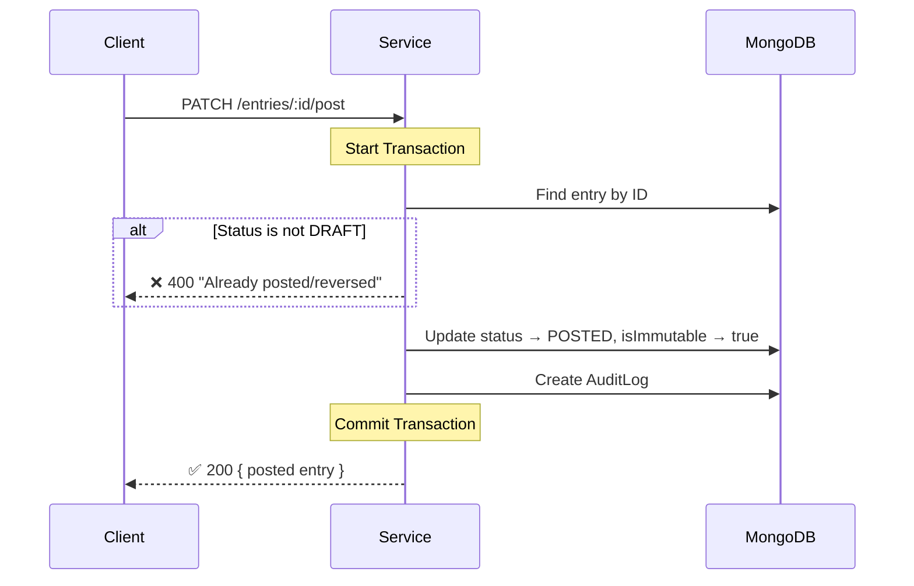
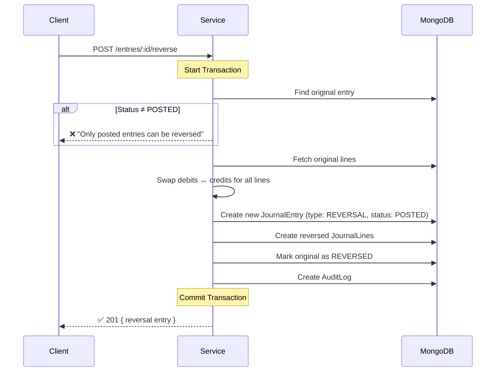
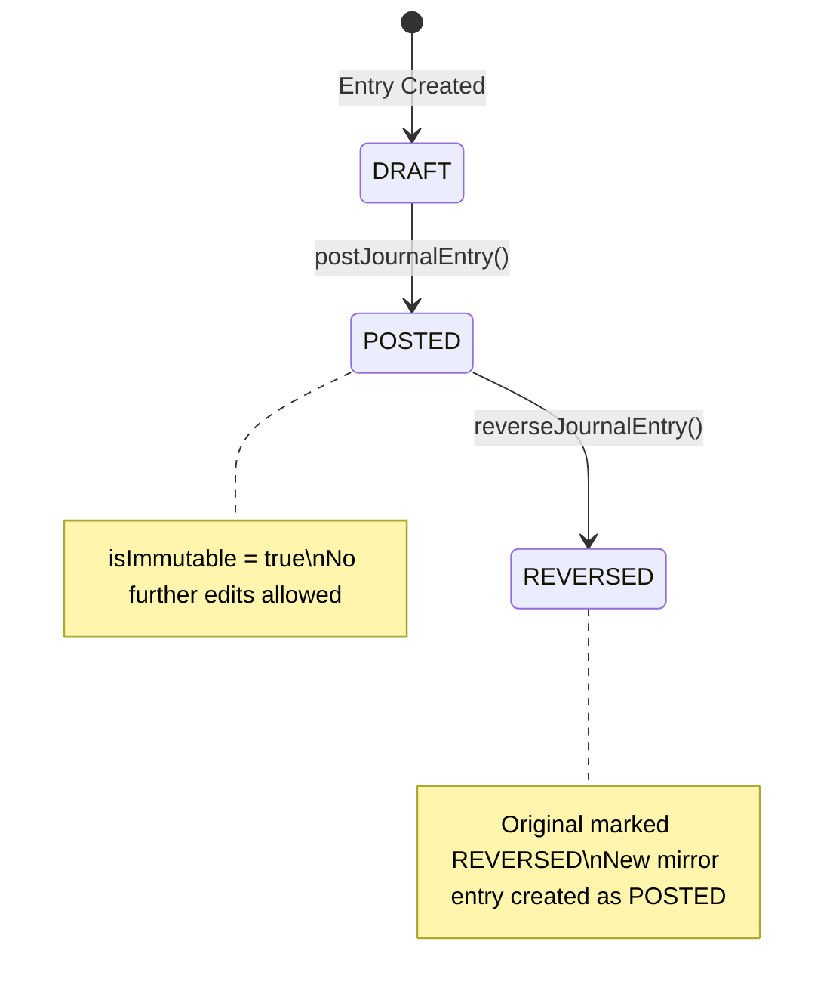
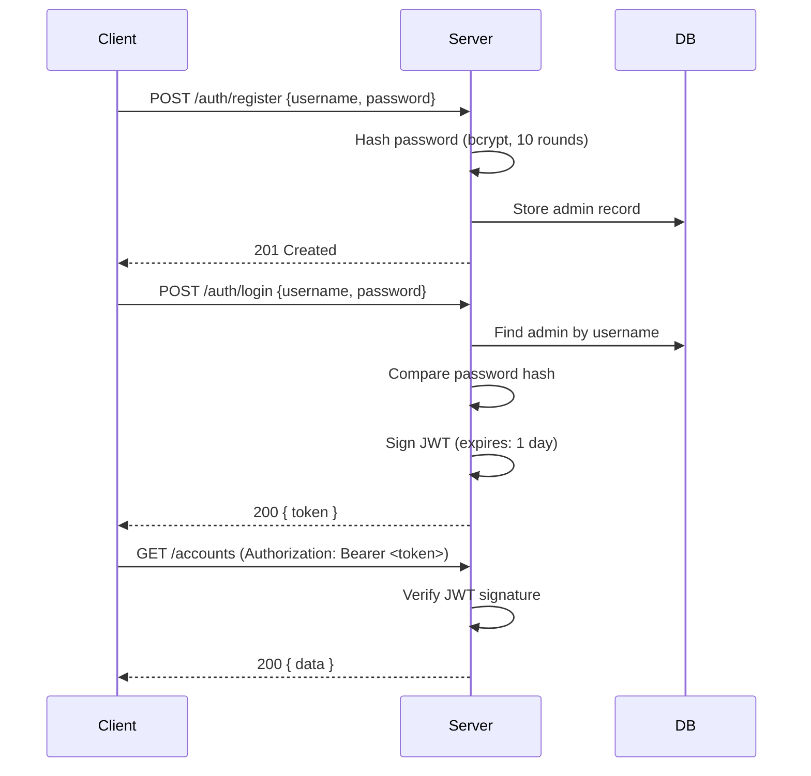
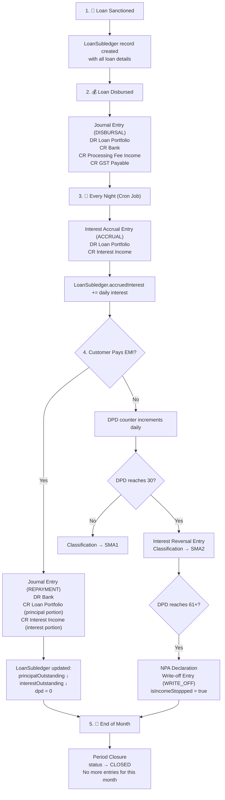

# 📒 Accounts Backend — Complete Architecture & Developer Guide

> **Audience:** Developers with zero finance/accounting background.
> **Last updated:** 2 March 2026

---

## Table of Contents

1. [What Does This System Do?](#1-what-does-this-system-do)
2. [Accounting Crash Course (The Absolute Minimum You Need)](#2-accounting-crash-course)
3. [Tech Stack & Project Setup](#3-tech-stack--project-setup)
4. [Folder Structure](#4-folder-structure)
5. [Data Models (Database Schema)](#5-data-models-database-schema)
6. [Architecture Overview](#6-architecture-overview)
7. [Core Flow — How Money Moves Through the System](#7-core-flow--how-money-moves-through-the-system)
8. [API Reference](#8-api-reference)
9. [Business Logic Deep Dive](#9-business-logic-deep-dive)
10. [Security & Auth](#10-security--auth)
11. [Lifecycle of a Loan (End-to-End)](#11-lifecycle-of-a-loan-end-to-end)
12. [Glossary](#12-glossary)

---

## 1. What Does This System Do?

This is the **accounting engine** for a lending (loan) company. When someone takes a loan, pays it back, misses a payment, or any money-related event happens — this system **records it** using proper accounting rules (called "double-entry bookkeeping").

Think of it as the **financial diary** of the company, where every rupee that moves in or out is meticulously logged.

> [!IMPORTANT]
> This system does **not** handle the loan application process, customer management, or EMI collection itself. It only records the **accounting entries** (the financial impact) of those events.

---

## 2. Accounting Crash Course

> [!TIP]
> You don't need a CA degree. Just understand these 5 concepts and you'll be able to work on this codebase confidently.

### 2.1 The 5 Account Types

Every financial event involves one or more of these 5 types of "accounts" (think of them as labeled money buckets):

| Type | What It Means | Real-World Example |
|------|--------------|-------------------|
| **ASSET** | Things the company **owns** or is **owed** | Cash in bank, loans given to customers |
| **LIABILITY** | Things the company **owes** to others | GST payable to government, security deposits |
| **INCOME** | Money the company **earns** | Interest income, processing fees |
| **EXPENSE** | Money the company **spends** | Office rent, employee salaries |
| **EQUITY** | Owner's money in the business | Capital, retained earnings |

### 2.2 Double-Entry Bookkeeping (The Golden Rule)

> **Every transaction must have EQUAL debits and credits.**

This is the single most important rule. If ₹10,000 enters the bank, there must be a corresponding record of WHERE it came from. Like Newton's third law — every financial action has an equal and opposite reaction.

```
Example: Customer pays ₹10,000 EMI
┌────────────────────────────┬──────────┬──────────┐
│ Account                    │  Debit   │  Credit  │
├────────────────────────────┼──────────┼──────────┤
│ Bank (ASSET)               │ ₹10,000  │          │  ← money comes IN to bank
│ Loan Portfolio (ASSET)     │          │ ₹7,000   │  ← outstanding loan reduces
│ Interest Income (INCOME)   │          │ ₹3,000   │  ← we earned interest
├────────────────────────────┼──────────┼──────────┤
│ TOTAL                      │ ₹10,000  │ ₹10,000  │  ← MUST be equal ✅
└────────────────────────────┴──────────┴──────────┘
```

### 2.3 Debit vs Credit — Simplified

Forget the everyday meaning of "debit" and "credit." In accounting:

| Account Type | **Debit** means... | **Credit** means... |
|--------------|-------------------|-------------------|
| ASSET | ↑ Increase | ↓ Decrease |
| EXPENSE | ↑ Increase | ↓ Decrease |
| LIABILITY | ↓ Decrease | ↑ Increase |
| INCOME | ↓ Decrease | ↑ Increase |
| EQUITY | ↓ Decrease | ↑ Increase |

### 2.4 Journal Entry

A "journal entry" is one complete transaction record. It contains:
- **Header**: Date, description (narration), who created it, what event caused it
- **Lines**: The individual debit/credit rows (minimum 2 lines)

### 2.5 Ledger & Sub-Ledger

- **General Ledger (GL):** The master book of ALL accounts. This system's [Account](file:///c:/Users/91637/accounts_backend/src/models/account.ts#3-17) model is the GL.
- **Sub-Ledger:** A detailed breakdown for a specific category. The [LoanSubledger](file:///c:/Users/91637/accounts_backend/src/models/loanSubLedger.ts#3-28) in this system tracks each loan's individual financial details.

---

## 3. Tech Stack & Project Setup

| Component | Technology |
|-----------|-----------|
| Runtime | Node.js + TypeScript |
| Framework | Express.js v5 |
| Database | MongoDB via Mongoose v9 |
| Auth | JWT (jsonwebtoken) + bcryptjs |
| Security | Helmet (HTTP headers), CORS |
| Dev Tools | Nodemon, ts-node |

### Environment Variables

```env
PORT=7000             # Server port
MONGODB_URI=<uri>     # MongoDB connection string
JWT_SECRET=<secret>   # JWT signing secret
```

### Running the Project

```bash
npm install          # Install dependencies
npm run dev          # Start dev server (nodemon + ts-node)
npm run build        # Compile TypeScript
npm start            # Run compiled JS (production)
```

---

## 4. Folder Structure

```
src/
├── index.ts                    # App entry point — Express setup & route mounting
├── config/
│   └── database.ts             # MongoDB connection logic
├── middlewares/
│   └── auth.middleware.ts       # JWT token verification middleware
├── models/                     # Mongoose schemas (database structure)
│   ├── account.ts              # Chart of Accounts (GL accounts)
│   ├── accountBalance.ts       # Period-wise balance snapshots
│   ├── admin.model.ts          # Admin user credentials
│   ├── auditLog.ts             # Immutable action history
│   ├── journalEntry.ts         # Transaction headers
│   ├── journalLine.ts          # Transaction line items (debits/credits)
│   ├── loanSubLedger.ts        # Per-loan financial tracking
│   └── periodClosure.ts        # Monthly accounting period locks
├── controllers/                # Request handlers (thin layer)
│   ├── account.controller.ts   # Account CRUD endpoints
│   ├── auth.controller.ts      # Register & login
│   └── journalEntry.controller.ts  # Journal entry operations
├── services/                   # Business logic (heavy lifting)
│   ├── account.service.ts      # Account operations + tree building
│   └── journalEntry.service.ts # Entry creation, posting, reversal
├── routes/                     # URL → Controller mapping
│   ├── account.route.ts        # /accounts/*
│   ├── auth.route.ts           # /auth/*
│   └── entry.route.ts          # /entries/*
└── utils/
    └── entryNumber.ts          # Auto-generates unique entry IDs (JE-YYYY-MM-XXXXX)
```

---

## 5. Data Models (Database Schema)

### 5.1 Entity Relationship Diagram



### 5.2 Model Details

#### Account (Chart of Accounts)

This is the master list of all financial "buckets." Each account has:

| Field | Purpose |
|-------|---------|
| `code` | Unique identifier like `1001`, `2001`. Used for sorting and quick lookup. |
| `type` | One of the 5 accounting types (ASSET, LIABILITY, INCOME, EXPENSE, EQUITY) |
| `subType` | Finer classification (e.g., "CURRENT_ASSET", "FIXED_ASSET") |
| `parentAccount` | Self-referencing FK — allows building a **tree** (e.g., "Assets" → "Current Assets" → "Bank - ICICI") |
| `isGSTApplicable` | Whether GST tax applies to this account |
| `gstType` | `INPUT` (buy), `OUTPUT` (sell), `RCM` (reverse charge) |
| `allowManualEntries` | Some system accounts shouldn't be touched manually |

#### JournalEntry (Transaction Header)

| Field | Purpose |
|-------|---------|
| `entryNumber` | Auto-generated: `JE-YYYY-MM-XXXXX` (e.g., `JE-2026-03-00042`) |
| `referenceType` | Why this entry was created — see table below |
| `status` | Lifecycle: `DRAFT` → `POSTED` → `REVERSED` |
| `isImmutable` | Once `POSTED`, set to `true` — prevents modification |
| `reversalOf` | If this is a reversal entry, points to the original |

**Reference Types Explained:**

| Type | When Used |
|------|----------|
| `LOAN` | New loan sanctioned |
| `DISBURSAL` | Money sent to customer's bank |
| `REPAYMENT` | Customer pays EMI |
| `EXPENSE` | Company incurs an expense |
| `MANUAL` | Manually created by accountant |
| `REVERSAL` | Undoing a previous entry |
| `ACCRUAL` | Daily interest calculation (not yet received) |
| `WRITE_OFF` | Loan declared unrecoverable |
| `WAIVER` | Partial amount forgiven |

#### JournalLine (Transaction Detail)

Each journal entry has **2 or more** lines. Each line represents one debit OR one credit (never both):

| Field | Purpose |
|-------|---------|
| `accountId` | Which account is affected |
| `debitAmount` | Amount debited (0 if credit line) |
| `creditAmount` | Amount credited (0 if debit line) |
| `loanId` / `customerId` | Links this line to a specific loan/customer for sub-ledger tracking |
| `costCenter` / `branch` | Organizational tagging for reporting |

#### LoanSubledger (Per-Loan Tracker)

This is the **detailed financial view** of each individual loan:

| Field | Plain English |
|-------|--------------|
| `disbursalAmount` | How much money was given to the customer |
| `processingFee` | One-time fee charged for processing the loan |
| `gstOnProcessingFee` | Tax on the processing fee (18% GST) |
| `interestRate` | Annual interest rate (e.g., 12%) |
| `tenure` | Loan duration in months |
| `emiAmount` | Fixed monthly payment amount |
| `principalOutstanding` | How much of the original loan amount is still owed |
| `interestOutstanding` | How much interest is owed but not yet paid |
| `accruedInterest` | Interest that has been earned but not yet collected |
| `dpd` | **Days Past Due** — how many days late the customer is on payments |
| `assetClassification` | Loan health rating (see below) |
| `isWrittenOff` | Whether the company has given up on collecting |
| `isIncomeStoppped` | Whether to stop recognizing interest income (NPA rule) |

**Asset Classification (Loan Health):**

| Classification | DPD Range | Meaning |
|---|---|---|
| `STANDARD` | 0 days | Customer is paying on time ✅ |
| `SMA1` | 1–30 days | Slightly late — early warning ⚠️ |
| `SMA2` | 31–60 days | Significantly late — needs attention 🟡 |
| `NPA` | 61+ days | Non-Performing Asset — loan is in trouble 🔴 |

#### PeriodClosure (Monthly Lock)

Accounting works in monthly periods. Once a month is "closed," no more entries can be posted to that month. This prevents backdating.

| Field | Purpose |
|-------|---------|
| `status` | `OPEN` = entries allowed, `CLOSED` = locked |
| `closedBy` | Who locked the month |

#### AccountBalance (Monthly Snapshot)

Stores the opening and closing balances for each account per month. Indexed uniquely on (`accountId`, `periodMonth`, `periodYear`).

#### AuditLog (Action History)

Every significant action is logged. This is immutable and used for:
- **Compliance** — regulators can see who did what
- **Debugging** — trace back problematic entries
- **Security** — detect unauthorized changes

---

## 6. Architecture Overview



### Design Principles

| Principle | Implementation |
|-----------|---------------|
| **Layered Architecture** | Routes → Controllers → Services → Models. Each layer has a single responsibility. |
| **Controllers are thin** | They only parse the HTTP request and return a response. Zero business logic. |
| **Services are thick** | All validation, business rules, and DB transactions happen here. |
| **Transaction safety** | Journal entries use MongoDB sessions + transactions. If ANY step fails, everything rolls back. |
| **Immutability** | Once a journal entry is POSTED, it cannot be edited. To "undo" it, you create a REVERSAL entry. |
| **Audit trail** | Every create/post/reverse action is logged to AuditLog. |
| **Period control** | Entries cannot be posted to a closed accounting period. |

---

## 7. Core Flow — How Money Moves Through the System

### 7.1 Creating a Journal Entry



### 7.2 Posting a Journal Entry



### 7.3 Reversing a Journal Entry

> [!NOTE]
> In accounting, you **never delete** an entry. Instead, you create a new entry that is the **mirror image** (debits become credits and vice versa). This is called a **reversal**.



---

## 8. API Reference

### 8.1 Authentication (`/auth`)

| Method | Endpoint | Description | Auth Required |
|--------|----------|-------------|:---:|
| `POST` | `/auth/register` | Register a new admin | ❌ |
| `POST` | `/auth/login` | Login and get JWT token | ❌ |

**Register Request:**
```json
{
  "username": "admin1",
  "password": "securePass123"
}
```

**Login Response:**
```json
{
  "message": "login successful",
  "token": "eyJhbGciOiJIUzI1NiIs...",
  "admin": { "id": "...", "username": "admin1" }
}
```

---

### 8.2 Accounts (`/accounts`)

| Method | Endpoint | Description |
|--------|----------|-------------|
| `POST` | `/accounts` | Create a new account |
| `GET` | `/accounts` | List all accounts (with optional filters) |
| `GET` | `/accounts/tree` | Get hierarchical account tree |
| `GET` | `/accounts/code/:code` | Find account by code |
| `GET` | `/accounts/:id` | Find account by ID |
| `PUT` | `/accounts/:id` | Update account |
| `PATCH` | `/accounts/:id/deactivate` | Soft-delete (deactivate) account |

**Query Filters for `GET /accounts`:**

| Parameter | Type | Example |
|-----------|------|---------|
| `type` | string | `?type=ASSET` |
| `isActive` | boolean | `?isActive=true` |
| `parentAccount` | ObjectId | `?parentAccount=665a...` |

**Create Account Request:**
```json
{
  "code": "1001",
  "name": "Bank Account - ICICI",
  "type": "ASSET",
  "subType": "CURRENT_ASSET",
  "parentAccount": null,
  "allowManualEntries": true,
  "isGSTApplicable": false,
  "description": "Primary operating bank account"
}
```

**Account Tree Response (simplified):**
```json
[
  {
    "code": "1000",
    "name": "Assets",
    "type": "ASSET",
    "children": [
      {
        "code": "1001",
        "name": "Bank Account - ICICI",
        "type": "ASSET",
        "children": []
      },
      {
        "code": "1100",
        "name": "Loan Portfolio",
        "type": "ASSET",
        "children": []
      }
    ]
  }
]
```

---

### 8.3 Journal Entries (`/entries`)

| Method | Endpoint | Description |
|--------|----------|-------------|
| `POST` | `/entries` | Create new journal entry (DRAFT) |
| `GET` | `/entries` | List entries with filters + pagination |
| `GET` | `/entries/:id` | Get single entry with its lines |
| `GET` | `/entries/loan/:loanId` | Get all entries for a specific loan |
| `PATCH` | `/entries/:id/post` | Post a draft entry (makes it immutable) |
| `POST` | `/entries/:id/reverse` | Reverse a posted entry |

**Query Filters for `GET /entries`:**

| Parameter | Type | Example |
|-----------|------|---------|
| `status` | string | `?status=POSTED` |
| `referenceType` | string | `?referenceType=DISBURSAL` |
| `loanId` | string | `?loanId=LOAN-001` |
| `fromDate` | ISO date | `?fromDate=2026-01-01` |
| `toDate` | ISO date | `?toDate=2026-03-31` |
| `page` | number | `?page=2` (default: 1) |
| `limit` | number | `?limit=50` (default: 20) |

**Create Journal Entry Request:**
```json
{
  "entryDate": "2026-03-02",
  "postingDate": "2026-03-02",
  "referenceType": "DISBURSAL",
  "loanId": "LOAN-001",
  "narration": "Loan disbursement to customer Rahul Sharma",
  "createdBy": "system",
  "lines": [
    {
      "accountId": "665a1234...",
      "debitAmount": 100000,
      "creditAmount": 0,
      "narration": "Loan portfolio - principal"
    },
    {
      "accountId": "665a5678...",
      "debitAmount": 0,
      "creditAmount": 98000,
      "narration": "Bank outflow"
    },
    {
      "accountId": "665a9abc...",
      "debitAmount": 0,
      "creditAmount": 2000,
      "narration": "Processing fee income"
    }
  ]
}
```

> [!WARNING]
> The sum of all `debitAmount` values MUST equal the sum of all `creditAmount` values. The API will reject the request otherwise.

---

## 9. Business Logic Deep Dive

### 9.1 Validation Rules ([journalEntry.service.ts](file:///c:/Users/91637/accounts_backend/src/services/journalEntry.service.ts))

The [validateLines()](file:///c:/Users/91637/accounts_backend/src/services/journalEntry.service.ts#43-80) function enforces these rules before any entry is created:

| # | Rule | Error Message |
|---|------|---------------|
| 1 | Minimum 2 lines required | "Journal entry must have at least 2 lines" |
| 2 | No negative amounts | "Debit and credit amounts cannot be negative" |
| 3 | A line can't have BOTH debit and credit | "A line cannot have both debit and credit amounts" |
| 4 | A line must have at least one non-zero amount | "A line must have either a debit or credit amount" |
| 5 | All referenced accounts must exist | "Account {id} not found" |
| 6 | All referenced accounts must be active | "Account {name} is inactive" |
| 7 | Total debits must equal total credits (rounded to 2 decimal places) | "Total debits must equal total credits" |

### 9.2 Entry Number Generation ([entryNumber.ts](file:///c:/Users/91637/accounts_backend/src/utils/entryNumber.ts))

Format: `JE-{YEAR}-{MONTH}-{SEQUENCE}`

```
JE-2026-03-00001  ← First entry of March 2026
JE-2026-03-00002  ← Second entry
JE-2026-04-00001  ← Sequence resets each month
```

The generator queries the last entry with the same prefix and increments the sequence. Padded to 5 digits.

### 9.3 Transaction Safety

All write operations in [journalEntry.service.ts](file:///c:/Users/91637/accounts_backend/src/services/journalEntry.service.ts) use **MongoDB sessions with transactions**:

```typescript
const session = await mongoose.startSession();
session.startTransaction();
try {
  // ... all DB operations pass { session }
  await session.commitTransaction();
} catch (err) {
  await session.abortTransaction();  // ← Everything rolls back
  throw err;
} finally {
  session.endSession();
}
```

> [!IMPORTANT]
> This means that if creating journal lines fails after the journal entry header is created, the header is also rolled back. The database is **never left in a half-created state**.

### 9.4 Immutability & the Reversal Pattern



- **DRAFT** → Can still be modified (though the code doesn't currently have an update endpoint)
- **POSTED** → `isImmutable = true`. The entry is locked. This is an accounting best practice — you never alter a finalized record.
- **REVERSED** → The original is marked as reversed, and a new entry with swapped debits/credits is created. Both entries remain in the system for the audit trail.

### 9.5 Account Tree ([account.service.ts](file:///c:/Users/91637/accounts_backend/src/services/account.service.ts))

The [getAccountTree()](file:///c:/Users/91637/accounts_backend/src/controllers/account.controller.ts#63-71) function builds a hierarchical tree from the flat list of accounts using `parentAccount` references:

```
Assets (1000)
├── Current Assets (1100)
│   ├── Bank - ICICI (1101)
│   └── Cash (1102)
└── Loan Portfolio (1200)
    ├── Term Loans (1201)
    └── Personal Loans (1202)
```

This is built in-memory using a two-pass algorithm:
1. First pass: Create a map of `id → account (with empty children array)`
2. Second pass: Link each account to its parent's children array. Accounts with no parent become root nodes.

---

## 10. Security & Auth

### Authentication Flow



### Security Layers

| Layer | Technology | Purpose |
|-------|-----------|---------|
| **Helmet** | `helmet` npm package | Sets secure HTTP headers (XSS protection, content-type sniffing prevention, etc.) |
| **CORS** | `cors` npm package | Controls which origins can call the API |
| **JWT Auth** | `jsonwebtoken` | Stateless token-based authentication |
| **Password Hashing** | `bcryptjs` (10 rounds) | Passwords are never stored in plain text |

> [!NOTE]
> The [authorizeAdmin](file:///c:/Users/91637/accounts_backend/src/middlewares/auth.middleware.ts#13-39) middleware is defined in [auth.middleware.ts](file:///c:/Users/91637/accounts_backend/src/middlewares/auth.middleware.ts) but is **not currently applied** to the account and entry routes. This appears intentional for development but should be added before production deployment.

---

## 11. Lifecycle of a Loan (End-to-End)

This section ties together architecture.md's flow with the actual code:



### What Happens at Each Stage:

| Stage | What the System Does | Models Involved |
|-------|---------------------|-----------------|
| **Loan Sanctioned** | Creates a [LoanSubledger](file:///c:/Users/91637/accounts_backend/src/models/loanSubLedger.ts#3-28) record with all financial terms | [LoanSubledger](file:///c:/Users/91637/accounts_backend/src/models/loanSubLedger.ts#3-28) |
| **Loan Disbursed** | Creates a [JournalEntry](file:///c:/Users/91637/accounts_backend/src/models/journalEntry.ts#3-32) with type `DISBURSAL` and corresponding [JournalLine](file:///c:/Users/91637/accounts_backend/src/models/journalLine.ts#3-17)s | [JournalEntry](file:///c:/Users/91637/accounts_backend/src/models/journalEntry.ts#3-32), [JournalLine](file:///c:/Users/91637/accounts_backend/src/models/journalLine.ts#3-17), [AuditLog](file:///c:/Users/91637/accounts_backend/src/models/auditLog.ts#3-13) |
| **Nightly Interest** | Creates `ACCRUAL` entries. Updates `accruedInterest` in sub-ledger | [JournalEntry](file:///c:/Users/91637/accounts_backend/src/models/journalEntry.ts#3-32), [JournalLine](file:///c:/Users/91637/accounts_backend/src/models/journalLine.ts#3-17), [LoanSubledger](file:///c:/Users/91637/accounts_backend/src/models/loanSubLedger.ts#3-28) |
| **EMI Payment** | Creates `REPAYMENT` entry. Splits payment into principal + interest portions | [JournalEntry](file:///c:/Users/91637/accounts_backend/src/models/journalEntry.ts#3-32), [JournalLine](file:///c:/Users/91637/accounts_backend/src/models/journalLine.ts#3-17), [LoanSubledger](file:///c:/Users/91637/accounts_backend/src/models/loanSubLedger.ts#3-28) |
| **Missed Payment** | `dpd` increments. Asset classification changes. At 30 days, interest reversal triggers. At 61+, write-off. | [LoanSubledger](file:///c:/Users/91637/accounts_backend/src/models/loanSubLedger.ts#3-28), [JournalEntry](file:///c:/Users/91637/accounts_backend/src/models/journalEntry.ts#3-32) |
| **Month End** | [PeriodClosure](file:///c:/Users/91637/accounts_backend/src/models/periodClosure.ts#3-12) status set to `CLOSED`. GST/bank reconciliation runs. | [PeriodClosure](file:///c:/Users/91637/accounts_backend/src/models/periodClosure.ts#3-12), [AccountBalance](file:///c:/Users/91637/accounts_backend/src/models/accountBalance.ts#3-16) |

---

## 12. Glossary

| Term | Definition |
|------|-----------|
| **Chart of Accounts (COA)** | The complete list of all financial accounts in the system — the [Account](file:///c:/Users/91637/accounts_backend/src/models/account.ts#3-17) model |
| **Journal Entry** | A single accounting transaction with multiple debit/credit lines |
| **Journal Line** | One row in a journal entry — either a debit OR a credit to a specific account |
| **General Ledger (GL)** | The master record of all account balances — aggregated from journal entries |
| **Sub-Ledger** | A detailed breakdown for a specific category (here: individual loans) |
| **DPD (Days Past Due)** | Number of days a borrower is late on their payment |
| **NPA (Non-Performing Asset)** | A loan where the borrower hasn't paid for 61+ days |
| **SMA (Special Mention Account)** | Early warning categories (SMA1 = 1-30 days late, SMA2 = 31-60 days) |
| **Accrual** | Recording income/expense when it is *earned/incurred*, not when cash moves |
| **GST** | Goods & Services Tax — Indian indirect tax (relevant for processing fees) |
| **RCM (Reverse Charge Mechanism)** | When the buyer pays GST instead of the seller |
| **Write-Off** | Removing an uncollectable loan from the books |
| **Waiver** | Forgiving part of the amount owed by the customer |
| **Period Closure** | Locking a monthly accounting period so no new entries can be backdated |
| **Narration** | A text description explaining why a journal entry was created |
| **CTC (Cost to Company)** | Not used here; general term — the total salary package of an employee |
| **ECL (Expected Credit Loss)** | Estimated future loan losses — used for provisioning |
| **DNBS** | Department of Non-Banking Supervision (RBI regulatory body) |
| **Provisioning** | Setting aside money to cover expected loan losses |
| **Immutable Entry** | A posted journal entry that cannot be modified — only reversed |
| **Reversal** | Creating a mirror-image entry to undo the effect of a posted entry |

---

> [!TIP]
> **For new developers:** Start by understanding the [Account](file:///c:/Users/91637/accounts_backend/src/models/account.ts#3-17) model (the buckets), then the [JournalEntry](file:///c:/Users/91637/accounts_backend/src/models/journalEntry.ts#3-32) + [JournalLine](file:///c:/Users/91637/accounts_backend/src/models/journalLine.ts#3-17) models (the transactions), and finally the [LoanSubledger](file:///c:/Users/91637/accounts_backend/src/models/loanSubLedger.ts#3-28) (the loan tracker). Everything else is supporting infrastructure.
